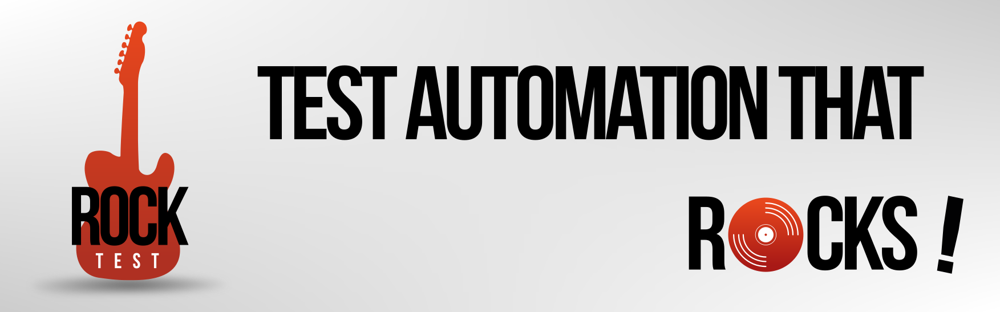

## Rock with _Katakoda_ !

See it live on Katakoda : https://www.katakoda.com/rocktest

## Getting started with Docker

You can use Rocker, the packaged Docker image of RockTest. 

To run a scenario, do the following commands (suppose $SCEN is the directory where your senarios are)

    $ cd $SCEN
    $ docker run -it --rm -v $PWD:/scen benoittouron/rocktest scenario.yaml

*Example*:

To execute a simple scenario :

    $ git clone https://github.com/rockintest/rocktest.git
    $ cd rocktest/docs/example/core
    $ docker run -it --rm -v $PWD:/scen benoittouron/rocktest display.yaml

## Getting started without Docker

Get the binary release :

    $ curl -L https://github.com/rockintest/rocktest/releases/download/v1.0.2/rocktest-1.0.2-bin.tar.gz --output rocktest.tgz

Extract the archive

    $ tar xzvf rocktest.tgz

Setup the environment :

    $ rocktest-1.0.2/sh/rocksetup
    $ . ~/.bashrc

Run the "display.yaml" scenario

    $ rocktest rocktest-1.0.2/core/display.yaml

You Rock !! 

## Build Rocktest

### Prerequisites

To run RockTest, you need the following :

#### Setup Java

- Go to https://adoptopenjdk.net/, download the package and install it. Make sure java and javac are in the PATH.

#### Setup Maven

- Download last version : https://maven.apache.org/download.cgi.
- Extract the ZIP, and the bin subdirectory in your PATH

#### Setup Selenium

As an option, to run the Web tests, you will need a Selenium server for your preferred browser.
- For Chrome : https://chromedriver.chromium.org/downloads
- For Firefox : https://github.com/mozilla/geckodriver/releases

Extract the binary and put it in your PATH.
You need the browser installed too, of course (chrome and/or Firefox).

#### A Shell

If you are under Linux, it's OK.

Under Windows, you can use either WSL or gitbash as a shell : https://gitforwindows.org/

This will install Git and Bash under your Windows box.

### Compilation

Open your shell, go to the right directory and do the following commands :

    $ git clone https://github.com/rockintest/rocktest.git
    $ cd rocktest
    $ mvn clean package
    $ sh/rocksetup

Close your shell and reopen it to enable the variables.

### Run your first scenario

Enter the following comands :

    $ cd $ROCK/scen-test
    $ rocktest hello.yaml

You should th some logs, with the message "Hello RockTest" and a scenario success

```
________               ______  ________              _____
___  __ \______ __________  /_____  __/_____ __________  /_
__  /_/ /_  __ \_  ___/__  //_/__  /   _  _ \__  ___/_  __/
_  _, _/ / /_/ // /__  _  ,<   _  /    /  __/_(__  ) / /_
/_/ |_|  \____/ \___/  /_/|_|  /_/     \___/ /____/  \__/
 Test automation that rocks !        (v1.0.0-SNAPSHOT)
09/01/2021 16:08:15.559 [INFO ] -  Starting RocktestApplication v1.0.0-SNAPSHOT on bouzin with PID 69786 (/home/ben/src/rock/rocktest/target/rocktest-1.0.0-SNAPSHOT.jar started by ben in /home/ben/src/rock/rocktest/scen-test)
09/01/2021 16:08:15.560 [DEBUG] -  Running with Spring Boot v2.3.0.RELEASE, Spring v5.2.6.RELEASE
09/01/2021 16:08:15.561 [INFO ] -  No active profile set, falling back to default profiles: default
09/01/2021 16:08:16.136 [INFO ] -  Started RocktestApplication in 0.893 seconds (JVM running for 1.288)
09/01/2021 16:08:16.138 [INFO ] -  Set variable module = hello
09/01/2021 16:08:16.138 [INFO ] -  Load scenario. name=hello.yaml, dir=.
09/01/2021 16:08:16.161 [INFO ] -  Set variable module = hello
----------------------------------------
09/01/2021 16:08:16.163 [INFO ] - [hello] Step#1 display,Hello RockTest !
09/01/2021 16:08:16.167 [INFO ] - [hello] Step#1 Hello RockTest !
----------------------------------------
========================================
=     Scenario Success ! It Rocks      =
========================================
```

### Congrats !

You have just run your first RockTest scenario.

To learn how to do HTTP requests, SQL requests, Web scenarios or HTTP mocks, check the documentation : https://rockintest.github.io/rocktest/

Or play live on Katakoda : https://katakoda.com/rocktest

Have fun with RockTest !
